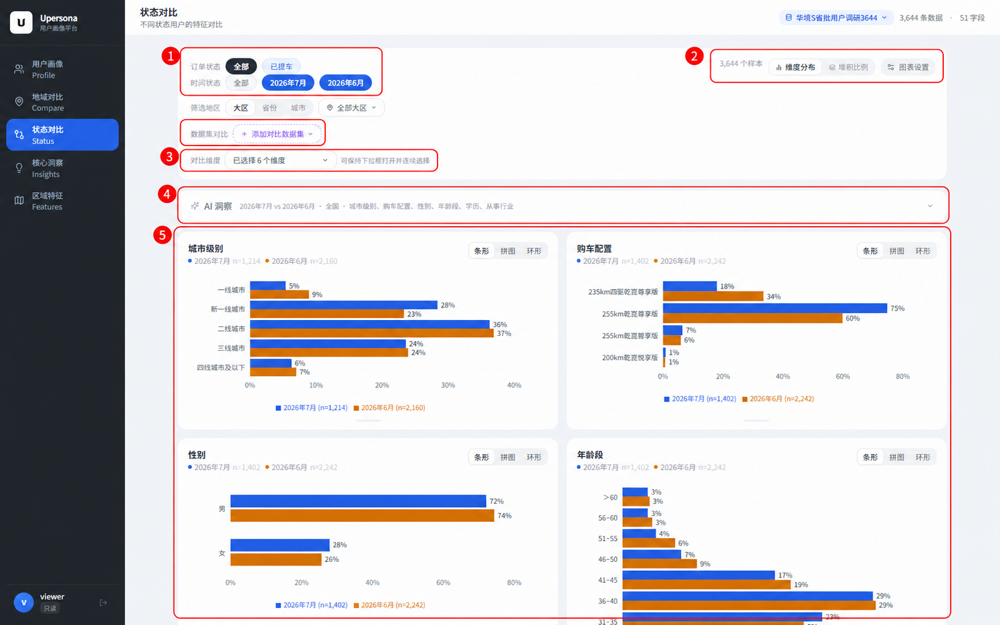
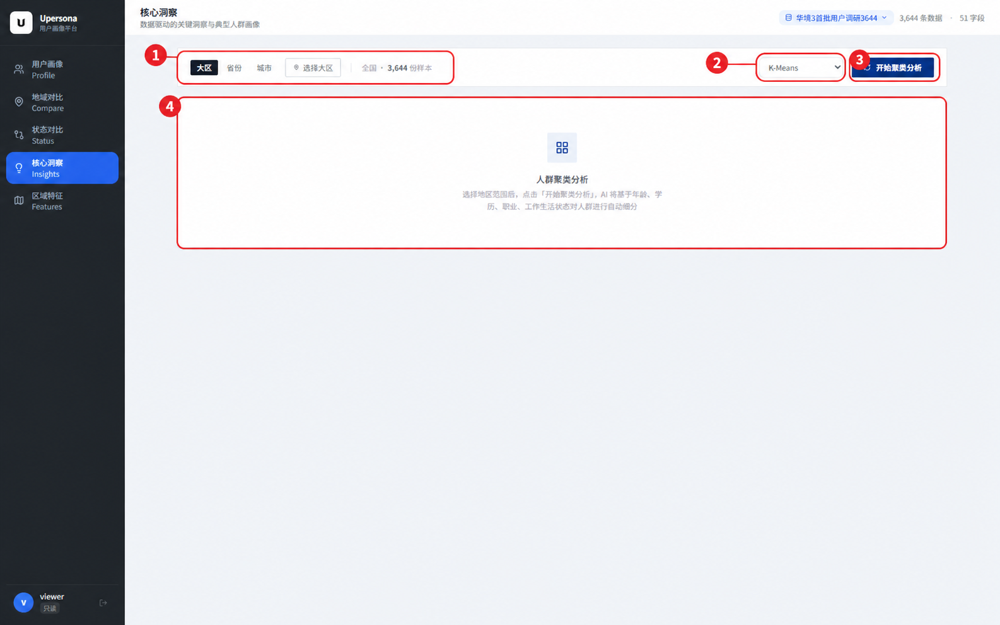
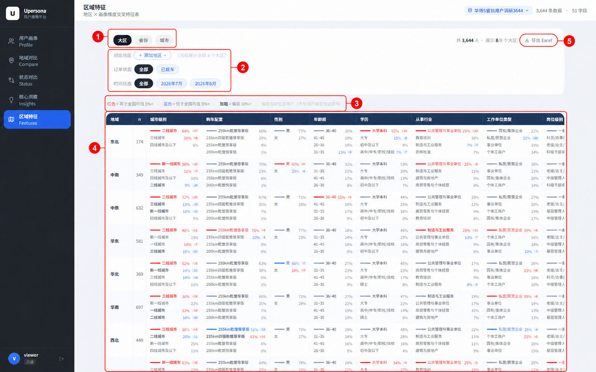
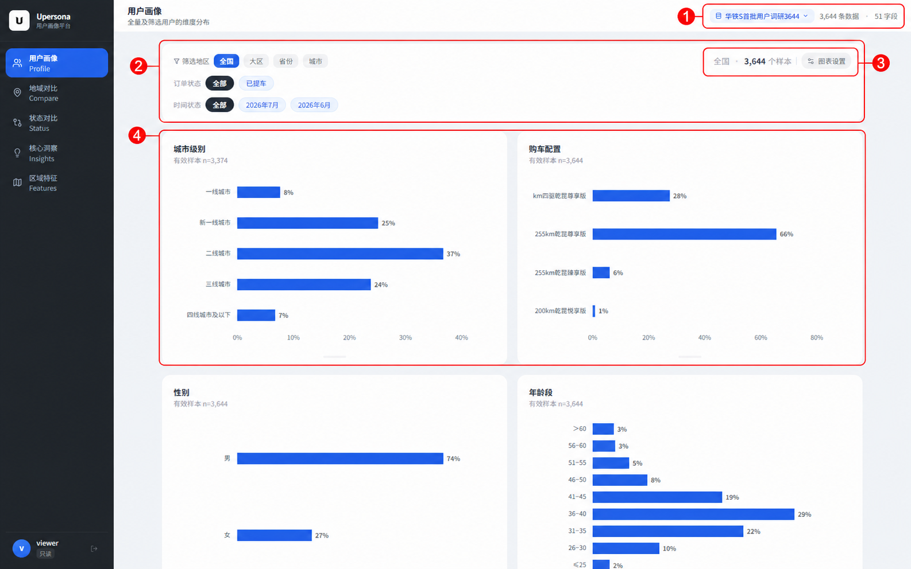

# Upersona 只读用户使用教程

示例数据集：华境 S 首批用户调研 3644

只读账号可以切换数据集、筛选样本、查看图表和导出结果，不能上传数据或修改公共配置。页面右上角应显示“华境 S 首批用户调研 3644”和 `3,644 条数据`。

## 开始前

1. 点击页面右上角的数据集名称。
2. 在下拉列表中选择“华境 S 首批用户调研 3644”。
3. 从左侧导航进入用户画像、状态对比、核心洞察或区域特征。

筛选操作不会修改原始数据。页面中的 `n` 表示当前图表实际参与计算的有效样本数。

## 用户画像

业务场景：了解首批用户的基本构成，回答“用户是谁”“主要集中在哪些城市级别”“偏好哪种配置”等问题。

### 操作

1. ① 确认数据集。名称、总样本数和字段数都显示在页面右上角。切换数据集后，先等图表加载完成。
2. ② 设置分析范围。
   - 地区可按全国、大区、省份或城市查看。选择“大区”后，再选择华东、华南等具体地区。
   - 订单状态可以查看全部样本，也可以只看已提车用户。
   - 时间状态支持同时选择 2026 年 6 月和 7 月；只保留一个月份时，页面显示该月画像。
3. ③ 检查样本量。顶部数字是筛选后的总样本数。样本明显减少时，结论要更谨慎。
4. ④ 阅读图表。每张卡片对应一个字段，标题下方的 `n` 是该字段的有效样本数。向下滚动可继续查看学历、行业、收入等字段。

### 怎么看

- 条形越长，占比越高。截图中二线城市占比 37%，是城市级别中的最大一组。
- 多选题的各项占比相加可能超过 100%，因为同一人可以选择多项。
- 图表顺序和选项顺序沿用管理员设置，不能把列表位置直接理解为重要性排名。

常用做法：先看全国全量画像，再只保留已提车用户，观察年龄、学历和购车配置是否发生变化。

## 状态对比

业务场景：比较不同月份、订单状态或地区的人群结构，回答“6 月与 7 月用户有何变化”“已提车用户与整体样本有何不同”。

### 操作

1. ① 选择对比组。至少选择两个时间状态才有对比意义。截图同时选择了 2026 年 6 月和 7 月。
2. 如需缩小范围，在“筛选地区”中选择大区、省份或城市。点击“添加对比数据集”可加入结构相近的数据集。
3. ② 选择展示口径。
   - “维度分布”以各组该字段的有效样本为分母，适合比较人群结构。
   - “堆积比例”适合查看各组对总体的构成。
4. ③ 打开“对比维度”，勾选城市级别、购车配置、性别、年龄段、学历、从事行业等字段。下拉框可以保持打开，连续选择。
5. ④ 展开 AI 洞察，查看系统对当前月份、地区和维度的差异说明。筛选条件变化后，应重新生成。
6. ⑤ 查看图表。蓝色和橙色分别代表两个时间状态，图例后的 `n` 是各组有效样本数。卡片右上角可切换条形、饼图和环形图。

### 怎么看

先比较百分点，再看样本量。例如截图中 7 月的 255 km 乾昆尊享版占比为 75%，6 月为 60%，相差 15 个百分点。不要把 15 个百分点写成“增长 15%”。

如果某个选项只差 1 至 2 个百分点，通常不值得单独下结论，尤其是在样本量较小时。

## 核心洞察

业务场景：把样本拆成几类相对集中的人群，辅助提炼目标客群、沟通话术和后续访谈对象。

### 操作

1. ① 选择分析范围。先选大区、省份或城市，再点击“选择大区”等按钮添加地区；不添加地区代表全国。
2. ② 选择聚类方法。一般使用默认的 `K-Means`。同一份分析要保持方法一致，否则前后结果不宜直接比较。
3. ③ 点击“开始聚类分析”。系统先计算人群分组，再生成文字洞察，通常需要几十秒。分析期间不要重复点击。
4. ④ 查看结果区。完成后会出现多张人群卡片，包含群体占比、代表特征、工作生活状态和购车偏好。

### 怎么看

先看每类人群占比，再看它与其他群体最不一样的字段。卡片中的百分比来自当前筛选数据，群体名称和文字说明属于系统归纳。

聚类适合发现线索，不是固定客户标签。若某个群体看起来反常，应回到用户画像核对对应字段；地区样本过少时，不建议单独生成聚类结论。

## 区域特征

业务场景：快速扫描各区域相对全国的差异，用于区域策略、投放侧重点或重点访谈城市选择。

### 操作

1. ① 选择地区层级。大区适合看全国结构，省份和城市适合继续下钻。层级越细，越需要关注样本量。
2. ② 设置对比范围。
   - “添加地区”用于只保留指定区域；默认展示全部地区。
   - 订单状态和时间状态会同时作用于整张表。
3. ③ 阅读颜色规则。红色表示高于全国均值至少 5 个百分点，蓝色表示低于全国均值至少 5 个百分点；加粗项与全国相差至少 10 个百分点。
4. ④ 阅读矩阵。每行是一个地区，每列是一个画像字段。先横向看一个地区的整体特征，再纵向比较同一字段在不同地区的差异。
5. ⑤ 点击“导出 Excel”，下载当前筛选条件下的区域特征表。导出前先确认地区层级、订单状态和月份。

### 怎么看

截图中，东北的二线城市占比为 64%，比全国高 27 个百分点；华东的制造与工业服务占比为 25%，比全国高 11 个百分点。此类红色加粗项更适合作为区域差异线索。

灰色项目接近全国水平，不必逐项解读。发现明显差异后，可回到用户画像或状态对比，检查该地区的样本量和具体分布。

