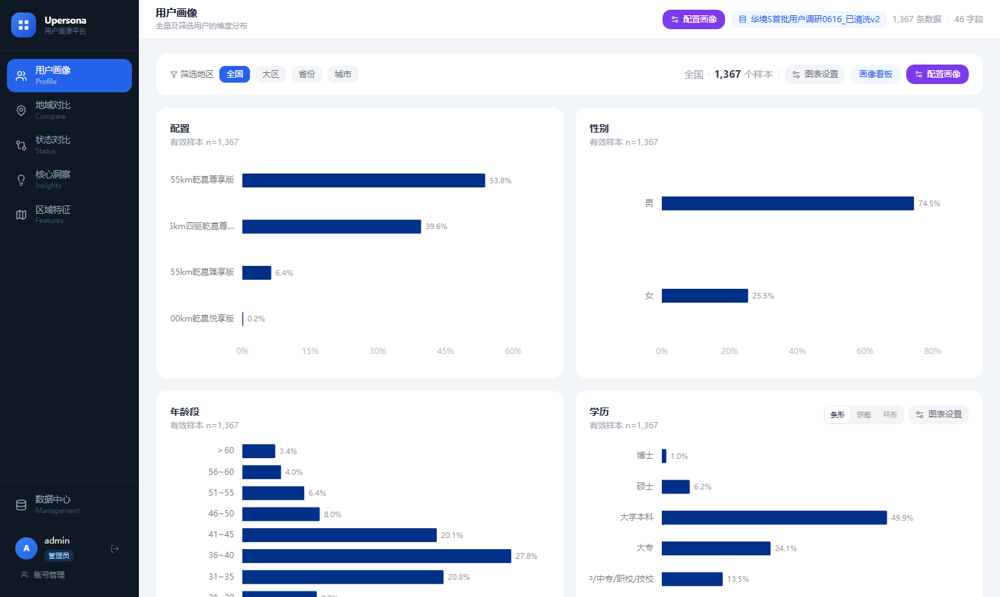
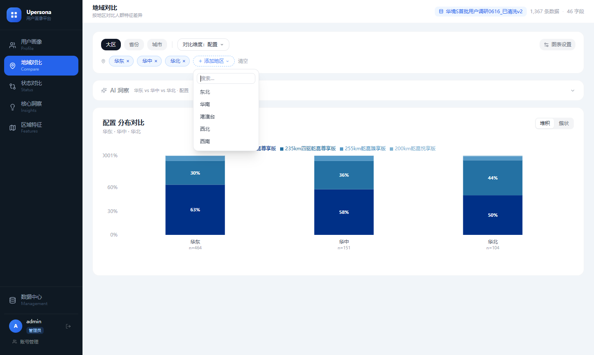
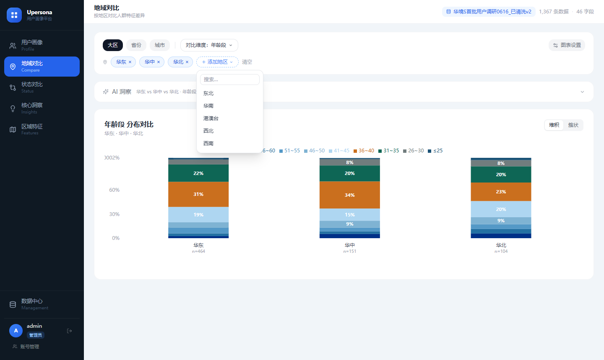
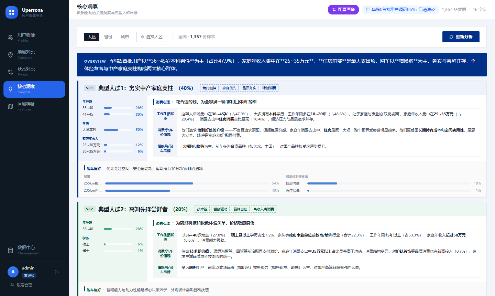
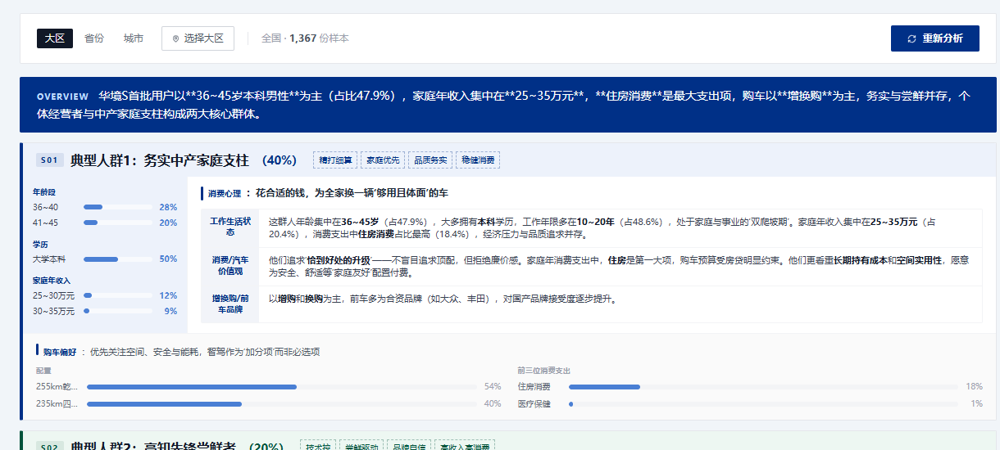
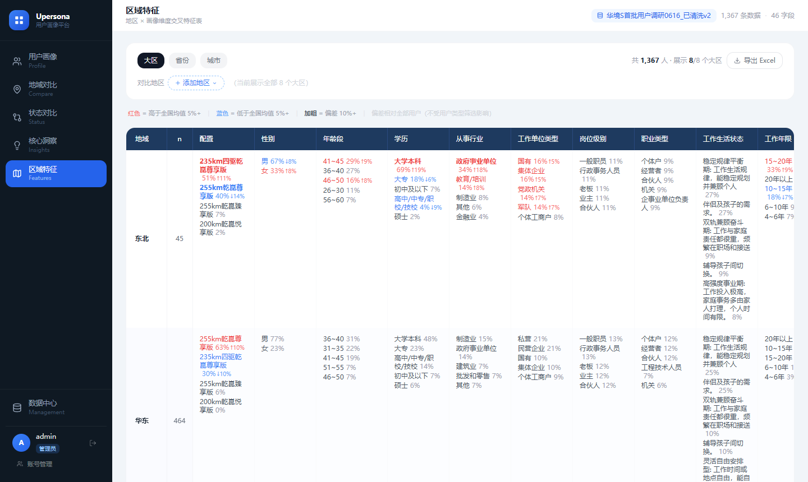

# Upersona 用户手册

> 适用对象：数据分析人员（查看权限）

---

## 目录

1. [登录](#1-登录)
2. [主界面](#2-主界面)
3. [用户画像](#3-用户画像)
4. [地域对比](#4-地域对比)
5. [状态对比](#5-状态对比)
6. [核心洞察](#6-核心洞察)
7. [区域特征](#7-区域特征)
8. [数据说明](#8-数据说明)

---

## 1 登录

打开系统地址，输入账号和密码，点击 **登录**。


> 账号由管理员创建并分配。登录状态以 Cookie 保持，浏览器关闭后需重新登录。勾选"30 天内免登录"可延长有效期。

---

## 2 主界面

登录后进入主界面，分三个区域：


| 区域 | 位置 | 说明 |
|------|------|------|
| **导航栏** | 左侧深色 | 切换视图；底部显示当前登录账号 |
| **顶部状态栏** | 上方白条 | 显示视图名称、数据集名称、总条数、字段数 |
| **主内容区** | 右侧大区域 | 当前视图的图表与分析内容 |

导航栏的五个视图：

| 视图 | 一句话说明 |
|------|-----------|
| 👥 **用户画像** | 全量/筛选用户在各维度上的分布图 |
| 📍 **地域对比** | 多个地区之间人群特征横向对比 |
| ⇄ **状态对比** | 不同月份样本的画像差异，可叠加订单状态筛选 |
| 💡 **核心洞察** | AI 生成的人群细分卡片 |
| 🗺 **区域特征** | 地区 × 维度交叉特征矩阵 |

> 顶部出现 `已同步：×××` 表示系统已从云端拉取最新数据集。

---

## 3 用户画像

**功能**：以图表卡片形式展示人群在各维度的分布，支持地区、订单状态、月份和画像分群筛选。



### 3.1 筛选人群

视图顶部提供地区筛选：点击 **全国 / 大区 / 省份 / 城市** 切换粒度，再从下拉选择具体地区（可多选）。不选任何地区 = 全国。

筛选后所有图表自动刷新，右侧样本量同步更新（如 `全国 · 1,367 个样本`）。

### 3.2 图表卡片

每个字段对应一张图表卡片，包含字段名、有效样本量（`n=xxx`）和图表主体。


- **条形图**：从长到短直接读占比，百分比标在柱末
- **饼图 / 环形图**：右上角可切换，点图例可高亮
- **排名热力图**：用于"最关注因素排名"类问题，颜色越深 = 选择人数越多

**切换图表类型**：点击卡片右上角的 `全形` `饼图` `环形` 按钮即可。

---

## 4 地域对比

**功能**：选定多个地区，对比它们在某一维度上的分布差异。

### 4.1 添加对比地区

点击顶部 **＋ 添加地区**，从下拉列表中勾选 2 个或更多大区 / 省份 / 城市。



选中地区后以 `地区名 ×` 标签形式显示，点 `×` 可移除，点 **清空** 全部移除。

### 4.2 选择对比维度

点击顶部 **对比维度** 下拉框，切换要分析的字段（如年龄段、学历、购车关注因素等）。

图表切换为该维度在各地区的对比图：



**读图方式**：
- 每组彩色堆叠柱 = 一个地区，柱内各色块 = 各取值的占比
- 上方图例对应各颜色的取值含义
- 各地区柱高相同（均为 100%），通过色块比例对比结构差异
- 柱下方的 `n=xxx` 是该地区的有效样本量

可以点击右上角 **簇状** 切换为并排条形图，更直观对比每个取值在各地区的绝对占比。

### 4.3 AI 差异解读

点击 **AI 洞察** 折叠区域，再点 **生成**，AI 基于当前图表数据输出：

- **核心差异**：最显著的地区差异（含数据引用）
- **成因与启示**：差异背后的判断及行动建议

> 结果会缓存；切换视图再回来无需重新生成，当筛选条件改变时才需要重新点击生成。

---

## 5 状态对比

**功能**：自动识别数据中的日期/时间字段，按月份对比不同批次样本在多个画像维度上的差异。

> 时间字段只用作状态变量，不会进入后续画像图表。若未识别到日期列，页面会提示前往数据中心上传带日期的数据。

### 5.1 选择状态

页面顶部把状态分为两组，两组都可连续点选：

- **订单状态**：全量或管理员配置的订单状态选项，用作样本筛选
- **时间状态**：自动从日期字段提取的 `YYYY年M月` 选项，用作对比组

### 5.2 选择对比维度

打开 **对比维度** 下拉复选框，可连续勾选多个画像字段。时间字段已经由系统排除，不会出现在此列表中。

### 5.3 查看和设置图表

每个维度显示一张月份对比图。页面可在维度占比与整体占比口径间切换，并可自选条形、饼形或环形图。图表颜色来自当前配色方案，系统会根据对比月份数量抽取反差较大的颜色。

图表底部支持拖动调整高度；也可聚焦拖动柄后使用上下方向键微调，按 Home 恢复默认高度。

### 5.4 跨数据集和 AI 洞察

当存在字段结构相近的数据集时，可选择另一个数据集进行同维度对比。点击 **生成** 后，AI 会依据当前月份、订单状态、维度和样本量生成差异结论。

---

## 6 核心洞察

**功能**：AI 对全量（或筛选后的）人群进行细分，以结构化卡片呈现每个细分群体的完整画像。



### 6.1 生成人群细分

1. 在筛选栏选择分析范围（全国 / 特定地区）
2. 确认聚类维度已选择（页面顶部），点击 **生成洞察**
3. 等待约 15–30 秒，AI 分析完成后以卡片形式展示结果

> 已生成的结果会缓存，筛选条件不变时无需重复生成。

### 6.2 读懂人群卡片

每张卡片对应一个细分群体，结构如下：



**① 卡片头部**：群体名称 + 估算占比 + 4 个关键词标签（高度概括该群体的消费心理特质）

**② 左侧蓝色区 — 他们是谁**：AI 选出的最具代表性的 2–4 个人口特征，每行显示字段名 + 真实占比数据条

**③ 中部表格 — 消费心理**：三行分析：
- 工作生活状态
- 消费/汽车价值观
- 增换购/前车品牌（含内联数据条）

**④ 底部浅色区 — 购车偏好**：关注哪些维度，以数据条展示各选项分布

> **数据准确性**：卡片中所有百分比均来自真实数据计算，非 AI 估算。AI 只决定"展示哪些数据"，数值由系统实时计算。

### 6.3 对比不同筛选条件

通过顶部地区/状态筛选器，可以对特定子群（如"华南强意向用户"）单独生成细分洞察，与全量结果对比阅读。

---

## 7 区域特征

**功能**：以矩阵表格形式展示各地区在多个画像维度上的典型特征，适合快速横扫式阅读。



### 7.1 矩阵结构

- **行** = 地区（大区 / 省份）
- **列** = 画像维度字段
- **单元格** = 该地区在该维度 Top 3 取值，格式：`取值（占比%，Δ与全国差）`

**Δ（差值）含义**：

| 差值 | 含义 |
|------|------|
| `Δ+10%` | 该取值在本地区的占比比全国平均高 10 个百分点 |
| `Δ-8%` | 低于全国平均 8 个百分点 |

差值越大（绝对值），说明该地区在这一维度上的特征越突出、越有区分度。

### 7.2 添加 / 移除地区和维度

- 点击 **＋ 添加地区** / **＋ 添加维度**，从下拉列表勾选
- 已添加的标签可点 `×` 单独移除

### 7.3 AI 特征摘要

点击右上角 **生成** 按钮，AI 为矩阵中每个维度的每个地区提炼 2–3 个判断性描述词，叠加显示在单元格下方（如"理性价值主导（本科62%）"），便于快速阅读区域差异。

---

## 8 数据说明

### 8.1 百分比计算口径

```
某选项占比 = 选择该选项的人数 ÷ 该字段有效作答人数 × 100%
```

- **有效作答**：未作答的样本不计入分母，所以 n 值可能小于总样本量
- **多选题**：各选项占比之和可超过 100%（一人可选多项）
- **排名题**：以热力图展示，颜色深浅 = 该位次被选择的人数占比

### 8.2 差值（Δ）说明

地域对比和区域特征视图中均展示与全国均值的差值：

```
Δ = 筛选群体中该选项占比 − 全量数据中该选项占比
```

正值表示高于全国，负值表示低于全国。

### 8.3 样本量参考

每张图表左上角显示 `n=xxx`，表示计入该图表的有效样本数。

- 筛选后样本量过小（n < 30）时，分布可能存在较大随机波动，建议谨慎解读
- 总样本量显示在顶部状态栏（如 `1,367 条数据`）

### 8.4 AI 生成内容说明

| 视图 | AI 内容 | 数据来源 |
|------|---------|---------|
| 地域对比 | 差异解读 + 成因推断 | 当前对比图的真实数据 |
| 状态对比 | 转化信号 + 流失画像 | 当前对比图的真实数据 |
| 核心洞察 | 人群细分卡片 | 全量/筛选数据的字段分布 |
| 区域特征 | 特征描述词 | 各地区字段 Top 3 数据 |

> AI 输出基于真实数据生成，不编造不存在的数值。但判断性描述属于推断，需结合业务背景判断。

---

*手册版本：v1.0 | 对应系统：Upersona v3.1*
